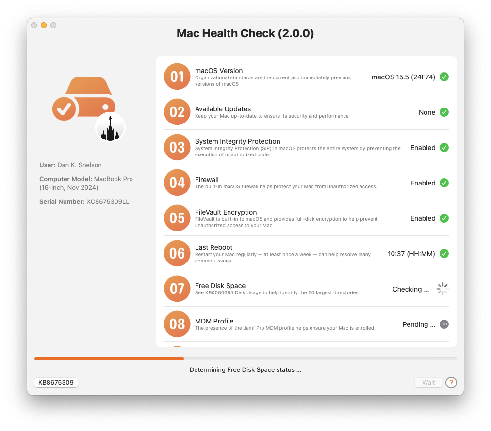
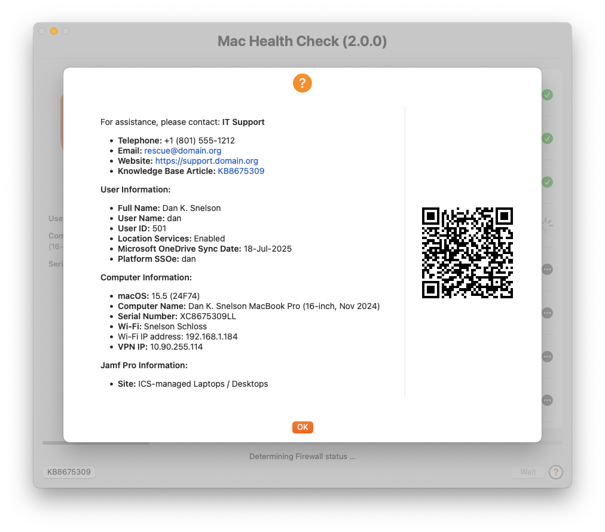

# Mac Health Check

## Overview

Mac Health Check provides a practical and user-friendly approach to surfacing Mac compliance information directly to end-users via Jamf Pro Self Service.

Built using the open-source utility [swiftDialog](https://github.com/swiftDialog/swiftDialog/wiki), the solution acts as a “heads-up display” that presents real-time system health and policy compliance status in a clear and interactive format.

The tool is particularly valuable in IT support workflows, serving as an initial triage point for Tier 1 support by confirming network access, credentials, and Jamf Pro connectivity, while also acting as a verification tool for Tier 2 teams both during and after remediation efforts.

Deployment of Mac Health Check involves configuring organizational defaults, embedding the script in Jamf Pro, creating a policy to run it on demand and testing to ensure proper output and behavior.

Administrators can customize the user interface using swiftDialog’s markdown and visual capabilities, making the experience both informative and approachable.

The tool logs results for IT review but does not alter device configurations, making it ideal for visibility without intrusion.

## Presentation

- [University of Utah Mac Admins](https://stream.lib.utah.edu/index.php?c=details&id=13709) (July 2025)

## Features
The following health checks and information reporting are included and the script operates in “test” mode by default. (Change `operationMode` to `production` when ready to deploy in production.)

### Health Checks

1. macOS Version
1. Available Updates (including deferred updates)
1. System Integrity Protection
1. Firewall
1. FileVault Encryption
1. Last Reboot
1. Free Disk Space
1. MDM Profile
1. MDM Certificate Expiration
1. Apple Push Notification service
1. Jamf Pro Check-in
1. Jamf Pro Inventory
1. BeyondTrust Privilege Management*
1. Cisco Umbrella*
1. CrowdStrike Falcon*
1. Palo Alto GlobalProtect*
1. Network Quality Test
1. Update Computer Inventory

*Requires [external check](/external-checks/README.md)

### Information Reporting

#### IT Support
- Telephone
- Email
- Website
- Knowledge Base Article

#### User Information
- Full Name
- User Name
- User ID
- Location Services
- Microsoft OneDrive Sync Date
- Platform Single Sign-on Extension

#### Computer Information
- macOS version (and build)
- Computer Name
- Serial Number
- Wi-Fi SSID
- Wi-FI IP Address
- VPN IP Address

#### Jamf Pro Information**
- Site

**[Payload Variables for Configuration Profiles](https://learn.jamf.com/en-US/bundle/jamf-pro-documentation-11.15.0/page/Computer_Configuration_Profiles.html#ariaid-title2)

### Policy Log Reporting

1. Warning when logged-in user is a member of `admin`
1. Deferred Software Updates
1. Logged-In User Group Membership
1. sudoers
1. Kerberos SSOe
1. Location Services
1. SSH
1. Time Machine
1. Battery Cycle Count
1. Network Time Server
1. Jamf Pro ID