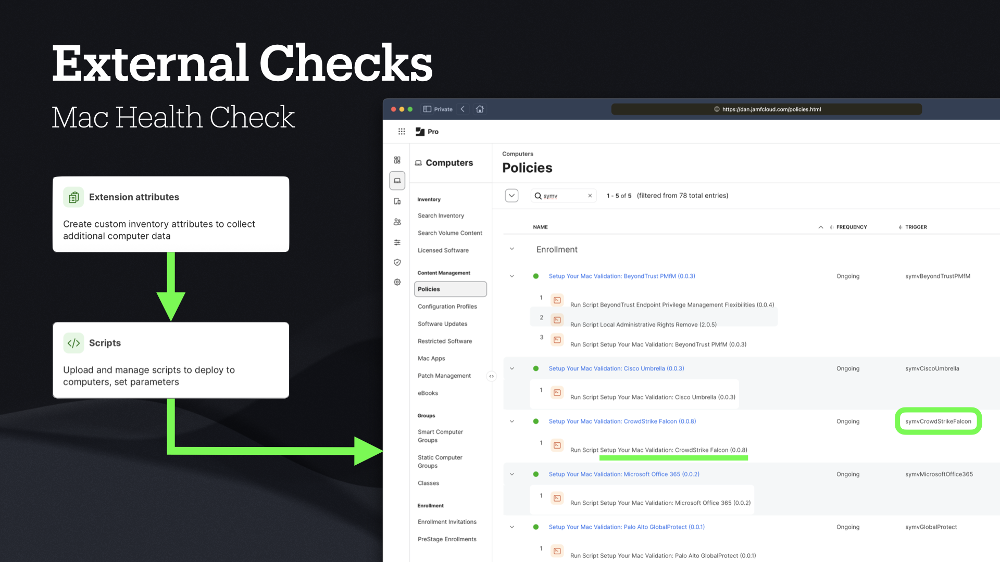

# Mac Health Check

## External Checks

This directory contains scripts that perform external checks for the services of various third-party applications. 

These checks are designed to be run in conjunction with the main Mac Health Check script to ensure comprehensive health checks.



External checks leverage code you’ve already written, simply added to a new, single-script Jamf Pro policy.

1. The code of an existing Extension Attribute …
1. … is saved as a Script in your Jamf Pro server.
1. This script is then added to a simple Jamf Pro policy, with a custom Trigger.

This custom Trigger and the path to the app itself — so that its icon can be displayed to the end-user — is then specified in Mac Health Check:

```
checkExternal "12" "symvBeyondTrustPMfM" "/Applications/PrivilegeManagement.app"
checkExternal "13" "symvCiscoUmbrella" "/Applications/Cisco/Cisco Secure Client.app"
checkExternal "14" "symvCrowdStrikeFalcon" "/Applications/Falcon.app"
checkExternal "15" "symvGlobalProtect" "/Applications/GlobalProtect.app"
```

When the policy successfully executes, the returned output must include the keyword `Running`, meaning the service which you’re checking is running.

```
*"Running"* ) 
    dialogUpdate "listitem: index: ${1}, status: success, statustext: Running"
    info "${appPath} Running"
    ;;
```